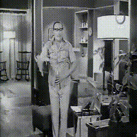
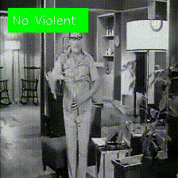

# Video Classification



## Introduction

In this project, we present a sophisticated model that combines Convolutional 3D (C3D) and Long Short-Term Memory (LSTM) architectures to effectively capture spatial and temporal information in videos. The goal of our work is to accurately classify videos into violent and non-violent categories using deep neural networks.

**Model Weights**

The model weights are not included in the GitHub repository. You can access them through [this Google Drive link](https://drive.google.com/drive/folders/1Ar8gs1rSR7QXci-kcJ_u8yFuujqQuump?usp=sharing).

## Dependencies and Installation
- Python >= 3.7 (We recommend using [Anaconda](https://www.anaconda.com/download/#linux) or [Miniconda](https://docs.conda.io/en/latest/miniconda.html))
- [TensorFlow >= 2.x](https://www.tensorflow.org/?hl=fr)

### Installation

**First, clone this repository from GitHub:**

```bash
git clone https://github.com/Bryan-Foxy/violence-detection/tree/main
cd violence-detection-main
```

Then, install the TensorFlow documentation:

```bash
pip install -q git+https://github.com/tensorflow/docs
```

Install all the required dependencies with specific versions used in our project:

```bash
pip install -r requirements.txt
```

## Dataset
We have split the dataset into frames, with each video yielding 10 frames. These frames are grouped into batches of 32 and normalized before being injected into the `tf.data.Dataset`. Normalization ensures that the pixel values fall within a standardized range, aiding in model convergence and performance.

## Model
We have developed two models: `C3D_LSTM` and `C3D`. 
The primary objective is to capture both spatial and temporal features effectively. 

### C3D Model
The C3D model is inspired by the paper titled ["Learning Spatiotemporal Features with 3D Convolutional Networks"](https://www.cv-foundation.org/openaccess/content_iccv_2015/papers/Tran_Learning_Spatiotemporal_Features_ICCV_2015_paper.pdf). It utilizes 3D convolutional layers to simultaneously capture spatial and temporal features in videos.

### C3D_LSTM Model
The C3D_LSTM model, a personalized variant, addresses the computational complexity and energy consumption associated with the C3D model. By reducing the number of filters and incorporating ConvLSTM2D layers, it achieves similar performance while being more resource-efficient.

### Key Differences
The ConvLSTM2D layer within the C3D_LSTM model introduces a memory component that captures long-term temporal information. This is crucial for video classification tasks as it combines spatial feature extraction capabilities with sequential modeling abilities.

## Training
The trained model showcased here is the **C3D_LSTM, boasting 4.5 million parameters** compared to the **C3D's 147 million**. It was trained on a CPU with 32 GB of RAM. For faster training, consider utilizing a GPU or cloud-based platforms like Google Colab or Kaggle Notebook.

The model underwent 12 epochs, utilizing the Adam optimizer with a learning rate of 2e-4 and Binary Cross-Entropy Loss. Given that the output is binary (violent or non-violent), a sigmoid activation function is employed in the final neuron.

The training of the C3D_LSTM model lasted 36 minutes. This duration encompassed the utilization of 80% of the dataset for training, equivalent to approximately 1600 videos, with the remaining 20% reserved for testing, totaling 329 videos. During the training phase, the model exhibited commendable performance, achieving an accuracy of **93%**. Upon evaluation on the test dataset, the model maintained a robust performance with an accuracy of **87%**. Notably, the model's generalization capacity is impressive, evident from its ability to achieve a **95%** accuracy when subjected to a separate test set comprising 200 videos. This underscores the model's capability to effectively generalize across a diverse spectrum of examples.

## Test
The script `test.py` serves a dual purpose: it functions both as an inference tool and as a means to evaluate the model. Upon accessing the file, users have the ability to input the file path of a video, which subsequently yields a new video appended with prediction tags.

<i>To conduct expedited testing, `inference.py` suffices. However, for more comprehensive analysis and the rapid loading of multiple video files, `test.py` offers greater utility.</i>

## Inference
The `inference.py` script facilitates testing of the pre-trained model. Simply specify the path to your video file within the code, and the script will generate predictions.

### Workflow
The inference process involves preprocessing the videos by splitting them into frames and batching them. These batches are then fed into the model to extract spatial and temporal information, followed by overlaying the model's predictions onto the video frames for visual interpretation.

### Usage

**First, download the weight and it the folder saves/checkpoint**

To utilize the C3D_LSTM model for inference:

```bash
python inference.py -i "input.mp4" -o "output.mp4"
```

Here, `-i` denotes the path to the input video, and `-o` specifies the path to save the output video. Please ensure the video is located in the same directory as `inference.py`.

Check out an example showcasing the model's performance:




## Other Demo


Thank you for your attention.